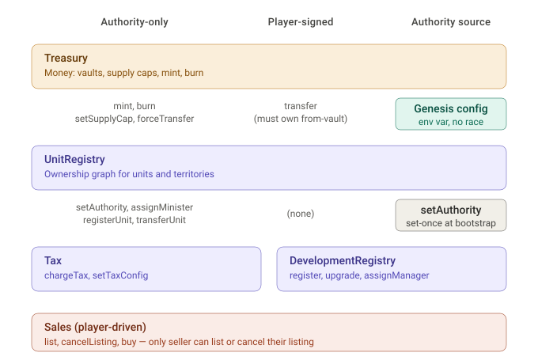
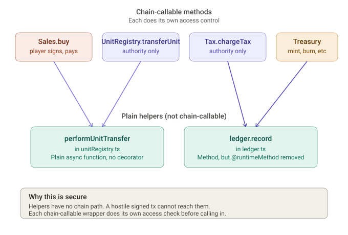

# MINALIA on Protokit

MINALIA is an on-chain territory game on Mina, where the game's economy (ownership, tax, sales, yields) runs on a Protokit appchain. The actual game logic — content, lore, social state, UI — stays in Supabase. This repo is the on-chain economy.

This is a **snapshot** taken from a working dev branch for the Protokit team to review. It is not a runnable Protokit project on its own; it's the MINALIA-specific runtime modules and tests we've built on top of the Protokit starter.

---

## What's here

### Runtime modules (`src/runtime/modules/`)

| Module | What it does |
|---|---|
| `treasury.ts` | Multi-class vaults (player, minister, king, duel-pot). Mint, burn, transfer, forceTransfer. Per-token supply caps. King-gated. Exports `performForceTransfer` as a shared helper for trusted internal callers. |
| `ledger.ts` | Append-only audit log keyed by global index. Every money movement and ownership event writes here, tagged with principal class, principal hash, token, credit, debit, kind, and block height. `record` is a plain helper, not chain-addressable. |
| `unitRegistry.ts` | On-chain ownership graph. Units keyed by `Poseidon(territoryId, slot)`. Territories store both the minister's NFT identity hash and the minister's PublicKey. Deployer-gated mutations. Exports `performUnitTransfer` and `assertMinisterOf(unitId)` as shared helpers. |
| `tax.ts` | Per-unit weekly tax with all-or-nothing debt accrual. `setTaxConfig` is deployer-gated (governance). `chargeTax` is **minister-gated per territory**: the territory's minister key signs, money flows into that minister's vault and nowhere else. |
| `sales.ts` | Two-step marketplace (`list`, `cancelListing`, `buy`). 2% fee deducted from seller proceeds, paid to the territory minister. Stale-listing protection. Player-driven (no authority). Composes `UnitRegistry` (via the shared helper) and `Treasury`. |
| `developmentRegistry.ts` | Per-unit development tracking. Each dev keyed by `Poseidon(unitId, devSlot)` with type, upgrade level, architect, and manager fields. Cross-module check that the unit exists. 1-to-15 slot cap enforced on-chain. Empty PublicKey rejected as architect. Currently deployer-gated; minister-scoping pending. |

### Tests (`src/test/`)

End-to-end tests run against a local Protokit `inmemory` chain. Each test boots a node client (or several, when multiple signers are needed), sends signed transactions, waits for settlement, and verifies state.

| Test | Assertions | Covers |
|---|---|---|
| `treasury-test.ts` | 21 | King-gated mint/burn/setSupplyCap, sender-owns-from on transfer, forceTransfer via the king-gated wrapper, automatic ledger entries on every movement |
| `unit-registry-test.ts` | 13 | assignMinister sets both ministerHash and ministerKey, registerUnit (player-owned + minister-held), transferUnit, **adversarial: non-deployer cannot register a unit** |
| `tax-test.ts` | 14 | Happy path payment, debt accrual when player can't pay, multi-cycle accrual, full clearance when player gets funds, **adversarial: non-minister cannot chargeTax** |
| `sales-test.ts` | 26+ | 6 happy paths + 9 adversarial scenarios (intruder lists, intruder cancels, direct `transferUnit` call, insufficient buyer balance, double-spend, stale listing after admin transfer, minister-held listing, zero price, unlisted buy) |
| `development-registry-test.ts` | 22 | 5 happy paths (register/upgrade/assignManager/transferArchitect/coexisting devs) + 9 adversarial scenarios (intruder mutations, register on missing unit, register on occupied slot, upgrade empty slot, out-of-range slot numbers, empty-PublicKey architect rejected) |

**All passing on a live chain.**

The ledger is covered indirectly by every test (treasury writes MINT/BURN/TRANSFER, sales writes SALE/SALE_FEE, tax writes TAX, unit/dev writes ownership and lifecycle events). `ledger.record` is no longer chain-callable, so there is no dedicated direct-write test for it.

---

## Authority architecture




MINALIA splits chain authority into **three independent roles**, none of which can rotate another:

| Role | Count | Powers | Lifecycle |
|---|---|---|---|
| **Deployer** | 1 | Bootstrap + governance: `assignMinister`, `registerUnit`, `transferUnit`, `setTaxConfig`. Currently also DevelopmentRegistry mutations (minister-scoping pending). | Active briefly at chain start; thereafter dormant except for rare governance ops. |
| **King** | 1 | Protocol-level supply: `mint`, `burn`, `setSupplyCap`. King-vault movements via `forceTransfer`. Future: currency-exchange commission. **Uninvolved in minister/tax operations.** | Active forever. Used by the website's currency-exchange backend. |
| **Minister × 20** | 20 | Their own district's `chargeTax`. Money flows from player vault into that minister's vault — never any other minister's. | Immutable after bootstrap. No on-chain rotation path. If a key is compromised, recovery is at the game layer (area relaunch). |

All three role public keys are hardcoded in `runtime/index.ts` as `DEPLOYER_PUB`, `KING_PUB`, and `MINISTER_PUBS[20]`. Per-territory minister keys are stored on-chain in `TerritoryState.ministerKey`, populated by `assignMinister` at bootstrap. The chain process itself needs no private keys; only the clients that sign transactions do.

Keys are generated via `scripts/generate-minalia-keys.mjs`. The private keys live outside the repo. The chain has its public keys baked in from block 0.

---

## Composition pattern (the headline learning)



When a player-driven module needs to mutate state owned by another module, exposing a second `@runtimeMethod` on the target module creates a hole — any user can craft a signed tx to that method directly. The Protokit team's recommended pattern (May 2026, via question) is to **extract the shared mutation logic into a plain (non-`@runtimeMethod`) helper function** that both modules' `@runtimeMethod`s call. Each `@runtimeMethod` does its own access control; the helper is just code, not externally callable.

This codebase uses the pattern in three places:

- `unitRegistry.ts` exports `performUnitTransfer(units, ledger, blockHeight, unitId, newOwner)` — a plain async function. Both `UnitRegistry.transferUnit` (deployer-gated) and `MinaliaSales.buy` (player-driven, after listing validation) call it.
- `treasury.ts` exports `performForceTransfer(balances, ledger, blockHeight, from, to, amount, kind)` — a plain async function. Both `Treasury.forceTransfer` (king-gated wrapper, for currency-exchange and other king-vault moves) and `MinaliaTax.chargeTax` (after asserting sender is the unit's minister) call it. This lets ministers move money out of player vaults into their own treasury without having to be the king.
- `ledger.ts`'s `record` method was demoted from `@runtimeMethod` to plain. Modules call it via `@inject` exactly as before, but it has no chain-addressable path so it cannot be invoked by a hostile signed tx.

The adversarial scenarios in `sales-test.ts` and `tax-test.ts` verify the security boundary: an intruder cannot list someone else's unit, cancel someone else's listing, call `transferUnit` directly, charge tax as a non-minister, buy without funds, double-spend a listing, exploit a stale listing, list a minister-held unit, list at zero price, or buy an unlisted unit. All blocked.

---

## Running these tests against a Protokit chain

The tests in `src/test/` are node scripts that submit signed transactions to a live Protokit chain via GraphQL. They expect the chain to be running on `localhost:8080`.

**Important #1: start the chain directly with `node` — not via `pnpm dev`.** Running the chain through `pnpm dev` (which invokes `turbo run dev`) silently drops every transaction in our environment. The chain produces blocks normally but every block reports `0 txs`. No errors are logged. State reads return null. We hit this for several hours before realising the wrapper was the cause; details and a reproduction in [proto-kit/framework#519](https://github.com/proto-kit/framework/issues/519).

**Important #2: three private keys are needed.** The chain process itself reads no env vars for keys (public keys are hardcoded in `runtime/index.ts`), but the tests sign transactions and so need access to private keys:
- `MINALIA_KING_PRIVATE_KEY` for `treasury-test` (and parts of `tax-test`, `sales-test`)
- `MINALIA_DEPLOYER_PRIVATE_KEY` for `unit-registry-test`, `development-registry-test`, and parts of `tax-test`, `sales-test`
- The tests that exercise `chargeTax` generate throwaway minister keypairs and register them as the territory's minister at bootstrap — so the real per-district minister keys are not needed for the test suite.

Generate the role keypairs (deployer + king + 20 ministers) via the helper script:

```bash
cd packages/chain
node scripts/generate-minalia-keys.mjs > /path/outside/repo/keys.env
chmod 600 /path/outside/repo/keys.env
```

Bake the public keys into `runtime/index.ts` (the script prints them so they can be copied across). Keep the file with the private keys outside the repo and chmod'd 600.

To start the chain:

```bash
cd packages/chain

nohup node \
  --loader ts-node/esm \
  --experimental-vm-modules \
  --experimental-wasm-modules \
  --es-module-specifier-resolution=node \
  ./src/start.ts \
  start ./core/environments/inmemory/chain.config.ts \
  --logLevel debug \
  > /tmp/protokit.log 2>&1 &
```

Wait until `Produced block #N (0 txs)` appears in `/tmp/protokit.log`. Then in the same shell (so the env vars persist):

```bash
set -a
source /path/outside/repo/keys.env
set +a

cd packages/chain
pnpm test:treasury
pnpm test:units
pnpm test:tax
pnpm test:sales
pnpm test:devs
```

`set -a` / `set +a` is required to actually export the variables to child processes — plain `source` only sets them as shell variables. Each test boots its own node client(s), submits txs, and waits 10–20 seconds per tx for settlement before checking state. The full suite takes about 30–40 minutes end-to-end. Restarting the chain between tests isn't required — the chain has nothing per-test to bootstrap, and each test uses distinctive territory IDs to avoid collision.

---

## How this fits into a Protokit project

This repo contains only the MINALIA-specific files. In the actual codebase they live inside a Protokit starter at `packages/chain/src/runtime/modules/` alongside the starter's `Balances`, `Withdrawals`, and `DevelopmentYield` modules.

The included `src/runtime/index.ts` references those starter modules in its imports. That's not an oversight; it's an honest snapshot of how MINALIA's modules slot into a Protokit project. To actually run this code, drop these files into a stock Protokit starter (`protokit-starter-kit`) and the imports resolve.

The included `src/test/*.ts` files use Protokit's `buildNodeClient` from `core/environments/node.config.ts`. That file isn't in this snapshot because it's part of the starter scaffold.

---

## Other architectural notes

### Audit ledger as unified event log

`MinaliaLedger` records both money movements (credit/debit > 0) and ownership events (credit/debit = 0). The `kind` field disambiguates. Off-chain code scans the ledger and filters by `principalClass + principalHash` or `kind`.

Kind ranges by domain:
- 1–24: money movement kinds (MINT, BURN, TAX, YIELD, SALE, etc.)
- 25: generic TRANSFER
- 100–102: unit lifecycle (REGISTERED, TRANSFERRED, MINISTER_ASSIGNED)
- 200–203: development lifecycle (REGISTERED, UPGRADED, ARCHITECT_TRANSFERRED, MANAGER_ASSIGNED)

### Cross-module reads

Modules can read each other's state via `@inject` and StateMap access. For example, `MinaliaDevelopmentRegistry.registerDevelopment` asserts that the target unit exists in UnitRegistry by reading `this.unitRegistry.units.get(unitId)`. Same pattern used by Tax (looks up owner, minister hash, and ministerKey — the last for authority enforcement via `assertMinisterOf`) and Sales (looks up unit + minister, re-checks ownership at buy time).

### Block height

Real block height read inside any `@runtimeMethod` via `this.network.block.height`. Used by Tax for cycle scheduling and by every ledger entry for audit chronology. API verified by reading `@proto-kit/protocol`'s `NetworkState.ts`.

### Fee math

Sales applies a 2% fee via basis-points: `fee = price * 200 / 10000`. Integer division truncates toward zero; for small odd prices this rounds slightly in favour of the seller (a 99-ARKIS sale yields 98 to seller, 1 to minister, instead of 97.02/1.98). Negligible at typical denominations. The trade-off is acknowledged in the test (`H5`).

### Treasury transfer vs forceTransfer

`transfer` is for **player-driven** moves: the sender must own the `from` vault, and `from` must be a player vault. System vaults (minister, king, duel-pot) cannot be the source. Used in Sales for the buyer-pays-seller leg.

`forceTransfer` is the king-gated wrapper around `performForceTransfer`, for **king-vault movements** (currency-exchange commission payouts and similar). Tax does NOT go through `forceTransfer` — it calls `performForceTransfer` directly after its own `assertMinisterOf` check, so the king is never involved in tax.

---

## Versions

- `o1js` `2.14.0-dev.e1080`
- `@proto-kit/*` `0.2.0`
- `tsyringe` `^4.10.0`
- Node 18.18.0

---

## Modules done / planned

| Done | Module |
|---|---|
| ✅ | MinaliaTreasury (king-gated, performForceTransfer helper) |
| ✅ | MinaliaLedger (non-chain-addressable) |
| ✅ | MinaliaUnitRegistry (deployer-gated, stores ministerKey, assertMinisterOf helper) |
| ✅ | MinaliaTax (setTaxConfig deployer-gated, chargeTax minister-gated per territory) |
| ✅ | MinaliaSales (player-driven, composes via performUnitTransfer + Treasury.transfer) |
| ✅ | MinaliaDevelopmentRegistry (deployer-gated; minister-scoping pending) |

| Planned | Module |
|---|---|
| | DevelopmentRegistry minister-scoping (use `assertMinisterOf`) |
| | Currency-exchange commission → king vault (king signs) |
| | JobRegistry — employment relationships |
| | Yields v2 — replaces toy DevelopmentYield, reads from UnitRegistry + DevelopmentRegistry |
| | Wages — minister/manager paying employed players |
| | Manager Cycles |
| | Build — players paying to construct new developments |
| | Leaderboard Payouts |
| | Duels |
| | Token Exchanges |

See `docs/MIGRATION.md` for the full roadmap.

---

## Contact

Game: [play.minaliens.xyz](https://play.minaliens.xyz)
Mainnet ARKIS token: `B62qohwzFkuzr39maSbXU3Vf6SUqsk7wWdAgyarM8euqCsgij5tbcUV`
